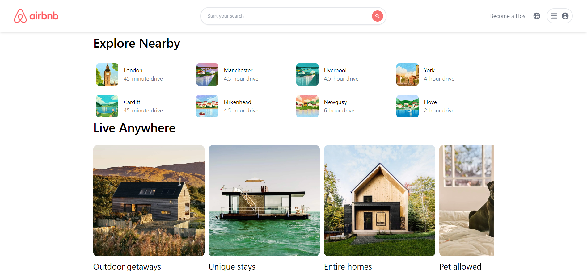
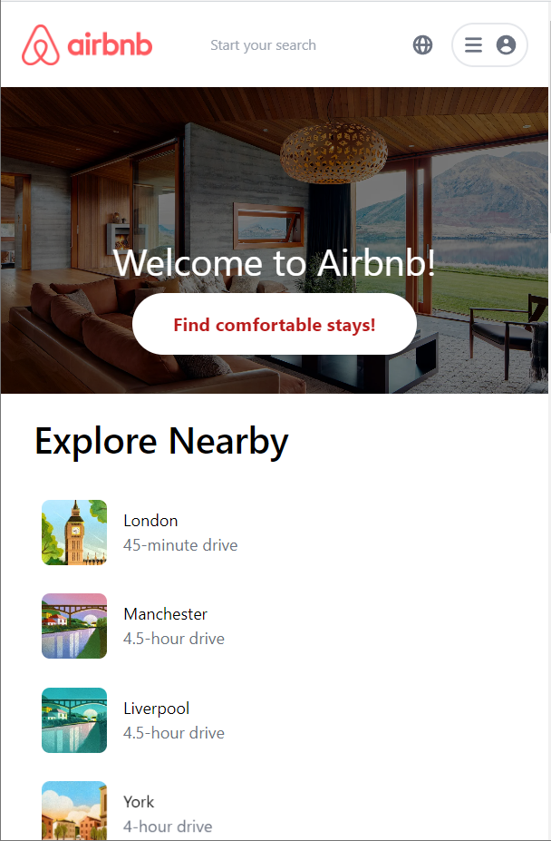

# AirBnB web app clone using Next.JS

## How to use
- Clone
- Run `yarn dev` in the terminal
- Visit "http://localhost:3000" from your web browser.

---------------

## Screenshots of Web App

<table>
  <tr>
    <td></td>
    <td></td>
  <tr>
    <td></td>
    <td></td>
  <tr>
    <td></td>
  <tr>
</table>

## Screenshots of Mobile

<table>
  <tr>
    <td></td>
    <td></td>
    <td></td>
  <tr>
</table>